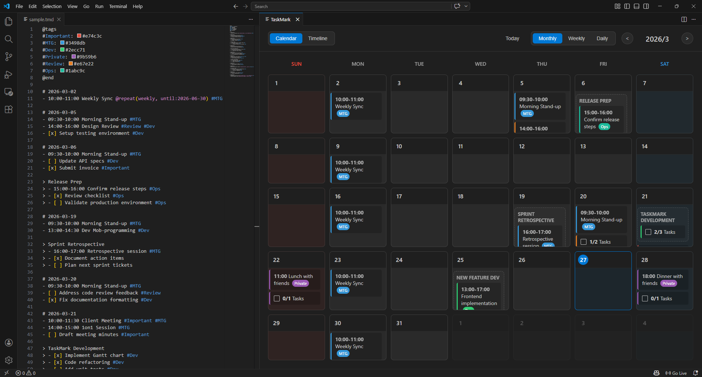
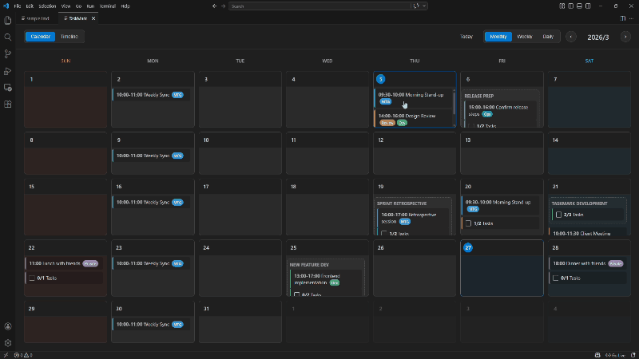
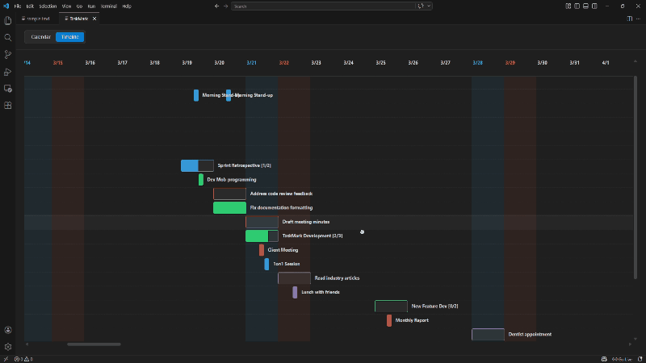

# TaskMark

**Markdown-Based Schedule & Task Management VS Code Extension**


[](https://marketplace.visualstudio.com/items?itemName=Yadecode.taskmark)


Write your schedules and tasks in a `.tmd` file using Markdown formatting and visualize them instantly in Calendar or Timeline (Gantt chart) views.




## Motivation

TaskMark aims to empower developers by bringing schedule and task management directly into the environment they use most: **VS Code**.

### The Problem
- **Frequent Context Switching**: Constantly switching between VS Code and external project management tools or browsers disrupts focus and flow.
- **Unfamiliar UI/UX**: Many task management tools have complex GUIs that don't align with the text-driven workflow developers prefer.

### The Solution
- **VS Code Integration**: Manage your entire schedule within your editor, eliminating the need to leave your workspace.
- **Developer-Friendly Syntax**: Write schedules and tasks using Markdown-inspired formatting that is intuitive for any programmer.
- **Instant Visualization**: Automatically transform your text-based plans into interactive Calendar and Timeline views.

## Built With

- **[TypeScript](https://www.typescriptlang.org/)** — Core extension logic and custom `.tmd` parser.
- **[VS Code Extension API](https://code.visualstudio.com/api)** — Seamless integration with the VS Code environment.
- **HTML / Vanilla CSS / JavaScript** — Lightweight, interactive, and theme-adaptive Webview UI.
- **[Mocha](https://mochajs.org/)** — Reliable testing for both unit and integration tests.

---

## Features

- **Theme Adaptive** — Seamlessly adapts to your active VS Code Color Theme (Light, Dark, and High Contrast).

### 📅 Calendar View

Switch between three granularity levels to check your schedule.




- **Monthly** — Overview of the entire month
- **Weekly** — Horizontal view of the week
- **Daily** — Detailed schedule for a specific day

**Interactions:**
- Click a date cell → Jump directly to the Daily view for that day
- `<` `>` Buttons → Navigate forward and backward in time
- `Today` Button → Return to the current date
- Saturdays are highlighted in blue, Sundays in red

### 📊 Timeline View (Gantt Chart)

Visualize schedule durations and project spans as a Gantt chart.




- **Pan** — Move smoothly in any direction by clicking and dragging
- **Zoom** — Use `Ctrl + Mouse Wheel` to zoom in/out (from days to hours)
- **Progress Bars** — Group task completion rates are displayed visually on the bars
- **Weekend Colors** — Colored backgrounds corresponding to the calendar view
- **Sub-rows** — Tasks inside a group are displayed as individual sub-rows beneath the group bar
- Grouped schedules appear as a single connected bar, while standalone items with the same name appear as separate blocks on the same row

### 🏷️ Tags & Colors

Categorize schedules and tasks visually with tags.

```tmd
@tags
#Important: #e74c3c
#MTG: #3498db
#Dev: #2ecc71
@end
```

Define tag colors inside the `@tags` block. Undefined tags automatically receive a deterministic, generated color based on the tag name.

### 🔁 Recurring Schedules

Automatically expand recurring schedules. Tasks (`- [ ]` / `- [x]`) manage independent completion states and are ignored by repeat modifiers.

```tmd
- 10:00-11:00 Weekly Sync @repeat(weekly) #MTG
- 09:00-10:00 Monthly Report @repeat(monthly, count:6) #Important
- 09:00 Morning Stretch @repeat(daily, until:2026-06-30)
- 14:00 Bi-Weekly 1on1 @repeat(every:2weeks, count:8) #MTG
- 10:00-11:00 Weekly Sync @repeat(weekly, except:2026-03-23) #MTG
```

| Modifier | Description | Example |
|------------|------|------|
| `daily` | Every day | `@repeat(daily)` |
| `weekly` | Every week | `@repeat(weekly)` |
| `monthly` | Every month | `@repeat(monthly)` |
| `every:Ndays` | Every N days | `@repeat(every:3days)` |
| `every:Nweeks` | Every N weeks | `@repeat(every:2weeks)` |
| `every:Nmonths` | Every N months | `@repeat(every:3months)` |
| `until:YYYY-MM-DD` | End date | `@repeat(weekly, until:2026-06-30)` |
| `count:N` | Occurrences | `@repeat(monthly, count:6)` |
| `except:YYYY-MM-DD` | Skip specific dates (space-separated for multiple) | `@repeat(weekly, except:2026-03-23 2026-04-06)` |

Options can be combined using commas. If a limit is not explicitly defined, recurrences will continually expand up to a safe maximum of 3650 occurrences (approx. 10 years).

> **Note on `except:`**: Skipped dates are simply removed from the schedule — the total count is not compensated. If you need a different schedule on a cancelled date, add a separate one-off item for that day.

---

## `.tmd` File Format

```tmd
@tags
#TagName: hex_color
@end

# YYYY-MM-DD
- HH:mm-HH:mm Schedule item #Tag
- HH:mm Schedule item with start time only
- Schedule item @repeat(weekly, until:2026-12-31)
- Schedule item @repeat(weekly, except:2026-03-23)
- [ ] Uncompleted task #Tag
- [x] Completed task

# YYYY-MM-DD : YYYY-MM-DD
- Multi-day event spanning date range #Tag
- [ ] Multi-day task spanning date range

> Group Name
> - 13:00-15:00 Schedule inside group #Tag
> - [x] Completed task inside group
> - [ ] Uncompleted task inside group
```

### Syntax Reference

| Syntax | Description | Applies to |
|------|------|------|
| `@tags` ... `@end` | Tag color definition block | — |
| `# YYYY-MM-DD` | Date header | — |
| `# YYYY-MM-DD : YYYY-MM-DD` | Date range header (start : end) | — |
| `- Text` | Schedule (Event) | — |
| `- [ ] Text` | Uncompleted task | — |
| `- [x] Text` | Completed task | — |
| `HH:mm-HH:mm` | Time range (Start-End) | Schedules |
| `HH:mm` | Start time only | Schedules |
| `#Tag` | Tags (Multiple allowed) | Both |
| `@repeat(...)` | Recurring items | Schedules only |
| `> Group Name` | Group header | — |
| `> - Item` | Items inside group | Both |

### 📅 Date Range Header

Use `# YYYY-MM-DD : YYYY-MM-DD` to define events or tasks that span multiple days as a **single entry**. Unlike `@repeat`, this does not create separate items for each day — the Timeline renders it as one continuous bar, and all Calendar views show it on every day within the range.

```tmd
# 2026-03-01 : 2026-03-10
- Conference Trip #Important
- [ ] Prepare conference materials #Dev
```

> **Note:** If the end date is invalid or earlier than the start date, the range is silently ignored and the header is treated as a single date.
>
> **Note:** Date range items are always treated as all-day — any time specification (`HH:mm`) is ignored in the Timeline view.
>
> **Note:** `@repeat` is ignored when used under a date range header. `endDate` takes priority.

---

## Usage

1. Open a `.tmd` extension file.
2. Open the TaskMark view using any of the following methods:
   - Click the **preview icon** in the editor title bar
   - Press `Ctrl+Shift+V` (macOS: `Cmd+Shift+V`)
   - Run **`TaskMark: Open View`** from the Command Palette (`Ctrl+Shift+P`)
3. View the Calendar / Timeline interface in a new panel.
4. Edit the `.tmd` file side-by-side; the view will reflect changes in real-time.

---

## Extension Settings

You can also define global tag colors in your VS Code `settings.json` to reuse them across multiple `.tmd` files.

- `taskmark.tagColors`: A JSON object mapping tag names (without `#`) to hex color codes.

```json
{
  "taskmark.tagColors": {
    "Important": "#e74c3c",
    "MTG": "#3498db",
    "Dev": "#2ecc71"
  }
}
```

*Note: Tags defined within a `.tmd` file via the `@tags` block will take precedence over global settings.*

---

## Feedback & Support

Found a bug or have a feature request? Please feel free to open an issue on our [GitHub Repository](https://github.com/tom-yade/taskmark/issues). Your feedback helps make TaskMark better for everyone!

---

## Project Structure

```
TaskMark/
├── src/
│   ├── extension.ts       # Extension entry point
│   ├── TaskmarkPanel.ts   # Webview panel management
│   ├── parser.ts          # .tmd file parser
│   └── test/
│       ├── runTest.ts     # Integration test runner
│       └── suite/
│           ├── index.ts             # Test suite entry point
│           ├── parser.test.ts       # Unit tests for the parser
│           └── extension.test.ts    # Integration tests for the extension
├── media/
│   ├── main.js            # Webview frontend logic
│   └── style.css          # Webview frontend styling
├── syntaxes/
│   └── tmd.tmLanguage.json  # Syntax highlighting definitions
├── sample.tmd             # Sample file
└── package.json
```

## Development

### Running Tests

This project uses Mocha for testing. There are two ways to run the tests depending on your needs:

#### 1. Unit Tests (Recommended / Fast)
Runs pure logic tests (e.g., the `.tmd` parser) without requiring the VS Code Extension host.
```bash
npm run test:unit
```

#### 2. Integration Tests
Downloads a VS Code instance and runs tests inside the extension host environment.
```bash
npm test
```

> Both test types are automatically run on every push and pull request via GitHub Actions CI.

---

## Contributing

Contributions are welcome! Here's how to get started:

1. Fork the repository
2. Create a feature branch from `develop` (`git checkout -b feat/your-feature`)
3. Make your changes and run the tests (`npm run test:unit`)
4. Open a Pull Request targeting the `develop` branch

Please open an issue first for significant changes so we can discuss the approach.

---

## License

This project is licensed under the MIT License - see the [LICENSE](LICENSE) file for details.
